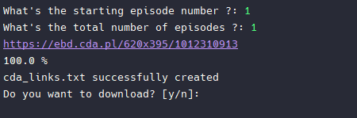

## **Dragon Ball Episode Downloader**

This is a Python script for downloading Dragon Ball episodes from [https://dbpolska.net](https://dbpolska.net/) or [https://cda.pl](https://cda.pl/).

You can install these modules by running **pip install requests beautifulsoup4 cda-downloader**.

## **Getting Started**

These instructions will get you a copy of the project up and running on your local machine for development and testing purposes or just for pure fun.

## **Prerequisites**

*   You will need Python 3 installed on your system: [https://www.python.org/](https://www.python.org/)
*   You will also need to install the required libraries:  
    `pip install requests beautifulsoup4 cda-downloader`
*   Alternatively, run this command for automatic module installation:  
    `pip install -r requirements.txt`

## **Installing**

Clone the repository:  
`$ git clone https://github.com/paichiwo/Dragon_Ball_PL_Downloader.git`  
`$ cd Dragon_Ball_PL_Downloader`  
`$ python3 Dragon_Ball_PL_Downloader.py`

## **Usage**

Follow the prompts to specify the starting episode number and the total number of episodes.

Wait for the script to finish downloading the episodes.

## **Notes**

This script only works with Dragon Ball episodes from [https://dbpolska.net](https://dbpolska.net/) or [https://cda.pl](https://cda.pl/).

The script will create a **cda\_links.txt** file in the same directory as the script. This file contains the links to the videos on cda.pl.

The script uses the **CDA** module to download the episodes.

By default, the script will download episodes to a directory called **download** - `c:\download\` on windows. You can change this by modifying the **path** argument in the **cda.download\_videos** method.

This script is provided as-is and comes with no warranty or support. Use it at your own risk.

## **Contributing**

Contributions are always welcome and appreciated! If you find any issues or have suggestions for improvements, please feel free to open an issue or pull request on the GitHub repository.

To contribute, please follow these steps:

1.  Fork the repository to your own GitHub account.
2.  Clone the repository to your local machine.
3.  Create a new branch for your changes.
4.  Make your changes and commit them with clear commit messages.
5.  Push your changes to your forked repository.
6.  Open a pull request to the main repository.

Please ensure that your code is well-documented, tested, and follows the existing code style and guidelines. By contributing, you agree to release your code under the same MIT license as the original code.

## **License**

This script is licensed under the [MIT License](https://opensource.org/licenses/MIT). Feel free to use and modify it as you wish.

## **Examples**
